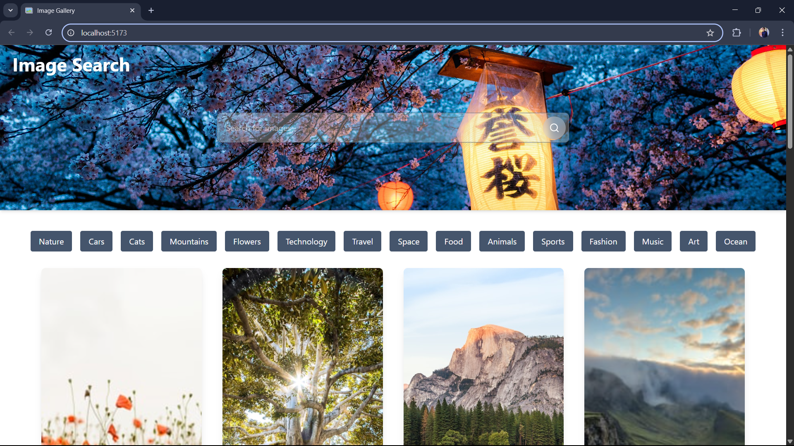
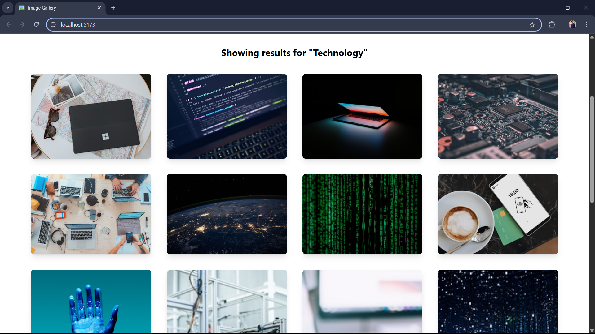
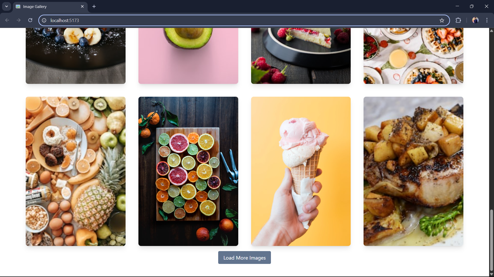

# 🖼️ Image Gallery App

A simple and elegant React-based image gallery app using the **Unsplash API**.  
Users can search for images, explore categories, and load more results easily.

## 🚀 Features

- 🔍 Search for images from Unsplash
- 📸 View trending categories (with suggestions)
- 🖼️ Responsive image grid
- 🗂️ Load more images

## 🛠️ Tech Stack

- **React**
- **Tailwind CSS** for styling
- **Unsplash API** for fetching images

## Screenshots

