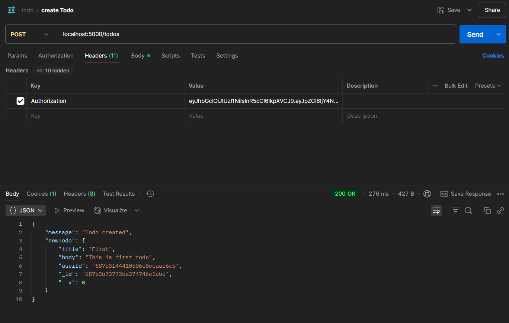
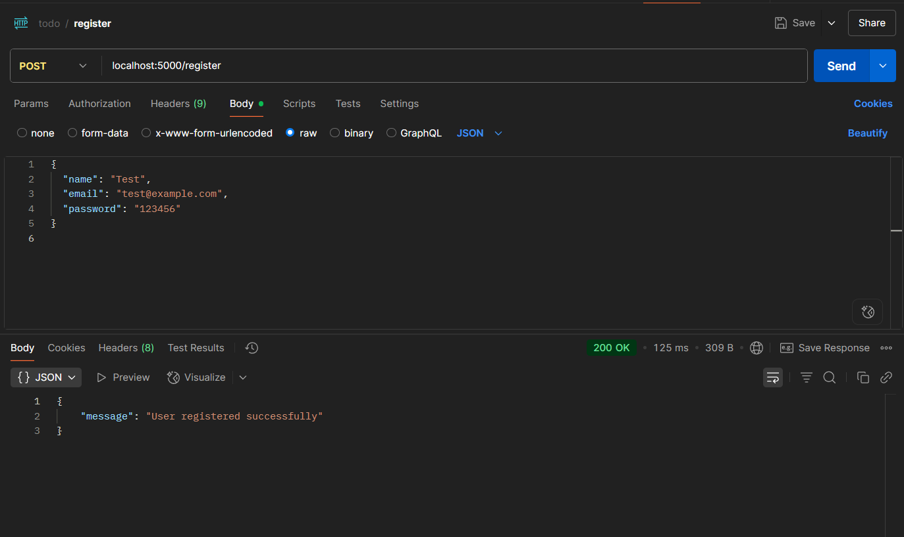
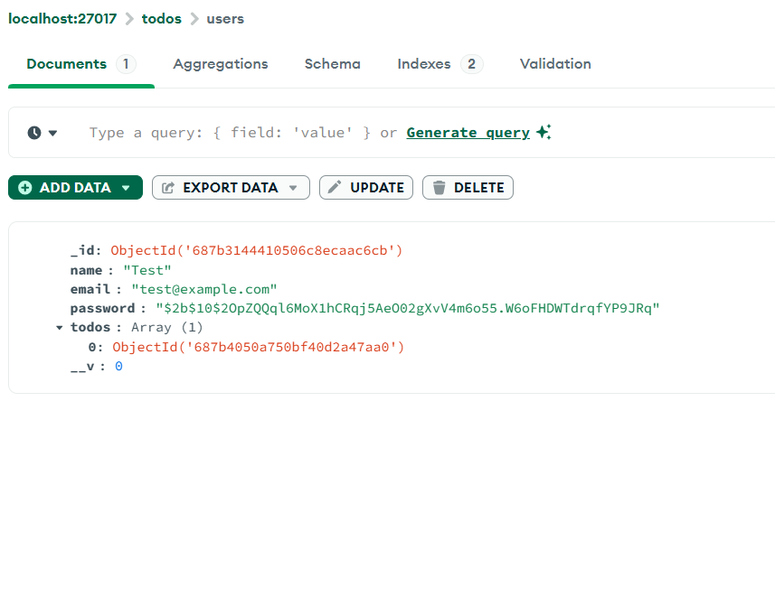
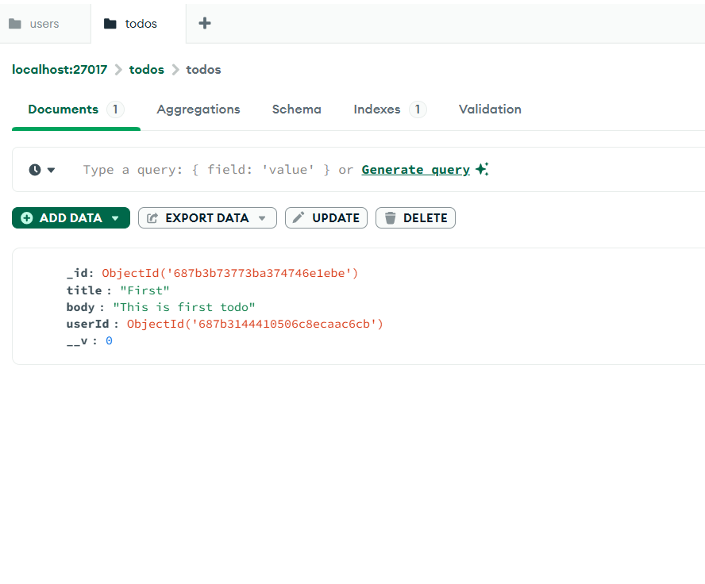

# Task 3-3: Todo App Backend (Node.js + Express + MongoDB)

A secure and modular **backend-only** implementation of a Todo App using **Node.js**, **Express**, and **MongoDB** with full user authentication, JWT-based access control, and user-linked Todo CRUD operations.

---

## Project Structure

```
Task_3-3/
├── controllers/
│   ├── userController.js
│   └── todoController.js
├── middleware/
│   └── userMiddleware.js
├── models/
│   ├── User.js
│   └── Todo.js
├── routes/
│   ├── userRoutes.js
│   └── todoRoutes.js
├── .env
├── .gitignore
├── app.js
└── server.js
```

---

##  Features Implemented

### User Authentication & Setup
-  Passwords are hashed using **bcrypt**
-  JWT-based authentication
-  Protected routes using a custom middleware
-  User model contains:
  - `name`
  - `email`
  - `password`

###  MongoDB Connection
- Connected using **Mongoose**
- Environment variables handled via `.env`

###  Routes

#### User Routes
- `POST /register` – Register a new user
- `POST /login` – Login with credentials
- `GET /profile` – Get current logged-in user info (JWT protected)

#### Todo Routes (JWT Protected)
- `POST /todos` – Create a new todo
- `GET /todos` – Fetch all todos of the user
- `GET /todos/:id` – Fetch a specific todo
- `PUT /todos/:id` – Update a specific todo
- `DELETE /todos/:id` – Delete a specific todo

---

##  User-Todo Relationship

Each `Todo` is linked to a specific `User` using MongoDB references.

```js
userId: {
  type: mongoose.Schema.Types.ObjectId,
  ref: "User",
  required: true
}
```

When a user is authenticated, all their todos are linked via this `userId` field.

---

##  Middleware

**`userMiddleware.js`**
- Verifies the JWT from cookies
- Attaches the authenticated user object to `req.user`
- Returns error if token is missing, invalid, or expired

---

##  Testing with Postman

You can test the backend with **Postman**:

1. Register a user via `POST /api/register`
2. Login and retrieve JWT via `POST /api/login`
3. Add the JWT token as a cookie in Postman (key: `Authorization`)
4. Access protected routes like `/api/profile` and `/api/todos`







---

## Environment Variables

Make sure to create a `.env` file in the root directory:

```env
PORT=5000
MONGO_URI=your_mongodb_connection_string
JWT_SECRET=your_secret_key
```

---

## Installation & Usage

```bash
# Clone the repo
git clone https://github.com/yourusername/task-3-3-backend.git
cd task-3-3-backend

# Install dependencies
npm install

# Create .env file and add your Mongo URI + JWT Secret

# Run the server
npm run dev
```

---

## Tech Stack

- **Node.js**
- **Express.js**
- **MongoDB + Mongoose**
- **JWT for authentication**
- **bcrypt for hashing**
- **Postman for testing**

---

